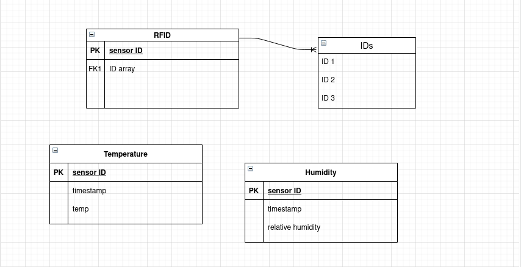
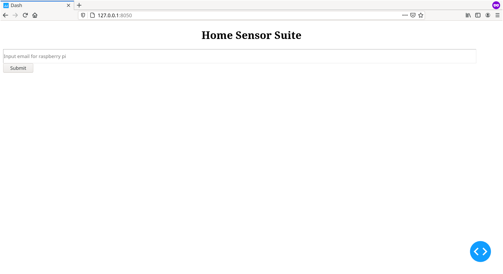

 

# Program Organization
Home-Suite-Home is an open-source sensor suite. It is designed to be lightweight, modular home
analytics suite that provides home-owners and property managers a platform to monitor the health of their properties through the useof smart sensors. On a high level of operation, the sensors are responsible for sending data to a localised database hosted by a server/agregator. The sever portion stores data for time-series representaton, and he aggregator portion observes values in real time to verify that sensor readings are within user defined parameters. The user will recieve notfications via email in the event of any data anomolies, or when requested for data snapshots or historical data.

# Code Design

# Data Design
Much of the data stored in this database will be unstructured. Sensors like the temperature/humidity sensor won't have many relations with one another. There are some sensor types that may have relational attributes, such as the RFID sensors which will require a table of valid IDs...

# Business Rules
- The system should record new sensor data every 30 seconds.
- The user should be able to add new sensors after initial setup through the GUI.
- The system should be able to store at least a year's worth of sensor data. This should be
calculated with a 'standard' sensor collection.

# User Interface Design

The purpose of this screen is to get the user's email so that the raspberry
pi knows where to send updates and statistics about the user's system.

After plugging in the RaspberryPi to power and ethernet, the user makes sure they are on the same wifi network as the RaspberryPi and types in the
IP address `127.0.0.1:8050` into their browser. The user then uses the mouse to click on the text box, and then they type their
email. Once the user presses submit, a confirmation email is sent to the user so that they know that sending an email works.

| Window Number | UID |
|---------------|-----|
| 1             | 011 |

# Resource Management
Computational load is divided among several ESP8266 modules with 2.5GHz? processors, and a
Raspberri Pi 3 with 2Gb? of RAM. The Pi is responsile for running the main script for the aggregator,hosting the GUI and related config files, as well as hosting the database forthe sensors. Further research is needed to determine the exact workload and resurce requirements 

# Security
This solution is designed to focus on ease of access and utility to the open-source community.
That said software security is not a primary concern for our implementation. The architecture of the system however, lends itself to being rather secure in practice. All traffic occurs over the local network, and so the data saved within the database is not seen except by those on said network.

# Performance
Our system is designed to run using low cost hardware such as, Raspberry Pi's. With recent advancements in these types of computers, performance should not be a concern. Our limitations may be considered as the hardware limitations of the entry level Raspberry Pi ([Technical Specifications](https://www.raspberrypi.org/products/raspberry-pi-4-model-b/specifications/)). Further, our system is designed to use a polling approach to sensor data collection. Meaning, the data can be collected and analyzed at the rate the aggregator (Raspberry Pi) becomes available. Lastly, the NodeMCU ESP8266 boards used to send sensor data should only be required to send their data at most every seccond which is well within their performance capabilities. 

# Scalability
The user will be able to add extra sensors up to a point, so as to provide greater breadth of analytics. The open source nature of our system lends itself to creating potentially limitless additional sensors and control systems. A single instance of the system can serve only proprty due to the localised nature of operation. Multiple properties may be monitored by setting up an aggregator server at each loction. 

# Interoperability
The sensors are responsible for sharing data with the database as well at the aggregator. The aggregator is responsible for receiving and responding to email requests from a user.

# Internationalization/Localization
Our implimentation is localized. All string handling will be ASCII and english. This may be modified in the future as the software is open source.

# Input/Output
The primary input/output(I/O) for our system will be HTTP requests between the aggregator and sensor modules. The I/O will be real-time. When a request is made, the reciever processes and sends a response to the requester. If the response is unexpected, the aggregator will handle the error as appropriate. 

# Error Processing
This solution focuses on monitoring sensor data and keeping the user informed. Should an error occur, the system may first attempt to correct it. For example, if a sensor does not respond, the request may be resent. In the case the error may not be corrected, the user will be notified via email and may take appropriate action. Also, any important information will be logged to a local file on the aggregator should an error occur.

# Fault Tolerance
The system is designed to continue to run through a multitude of faults. For example, if a sensor is unavailable or not working properly, the aggregator will continue to log all other sensors and check periodically to see if the issue with that sensor has been resolved. The system may also enter an alternate method of operation given a critical failure. As long as the aggregator is powered on and connected to the network, a user may still request email reports from the system. These reports may be ammended to reflect errors in the system.

# Architectural Feasibility
The architecture of our system is intended to grow into future features. This allows the architecture design to start out as feasible. With room to add features as the core system is developed.

# Overengineering
Our system is designed to continue to run through many issues. There is a one single point failure: the aggregator. If the aggregator encounters a hardware or power failure, the system will no longer function as intended. It is important to note that even without the aggregator the sensors can still be queried by HTTP requests from within the network.

# Build-vs-Buy Decisions
### Libraries Used
* cvdash
* ESP8266WiFi
* ESP8266WebServer
* Wire
* Adafruit_SHT31

*This section will continue to be updated as more code is added with the sprints to come...* 

# Reuse
We intend to use some open source libraries mentioned in the Build-vs-Buy Decisions. This code, where possible, will be built into functions that can be replaced in the event we pivot to different libraries. Beyond that, we currently have no intention to reuse code. This is subject to change as we progress though the design process. We will update this document should any changes arise.

*italic* This section will continue to be updated as more code is added with the sprints to come... 
# Change Strategy
The system is intended to be modular and adaptable. New sensors and their data can be added simply at any point in the future. We also intend to build the core functionality in a way that allows the base system to persist through many different perturbations of the higher level features. This will be accomplished by using simple, single responsibility functions and delineating data files between versions.
